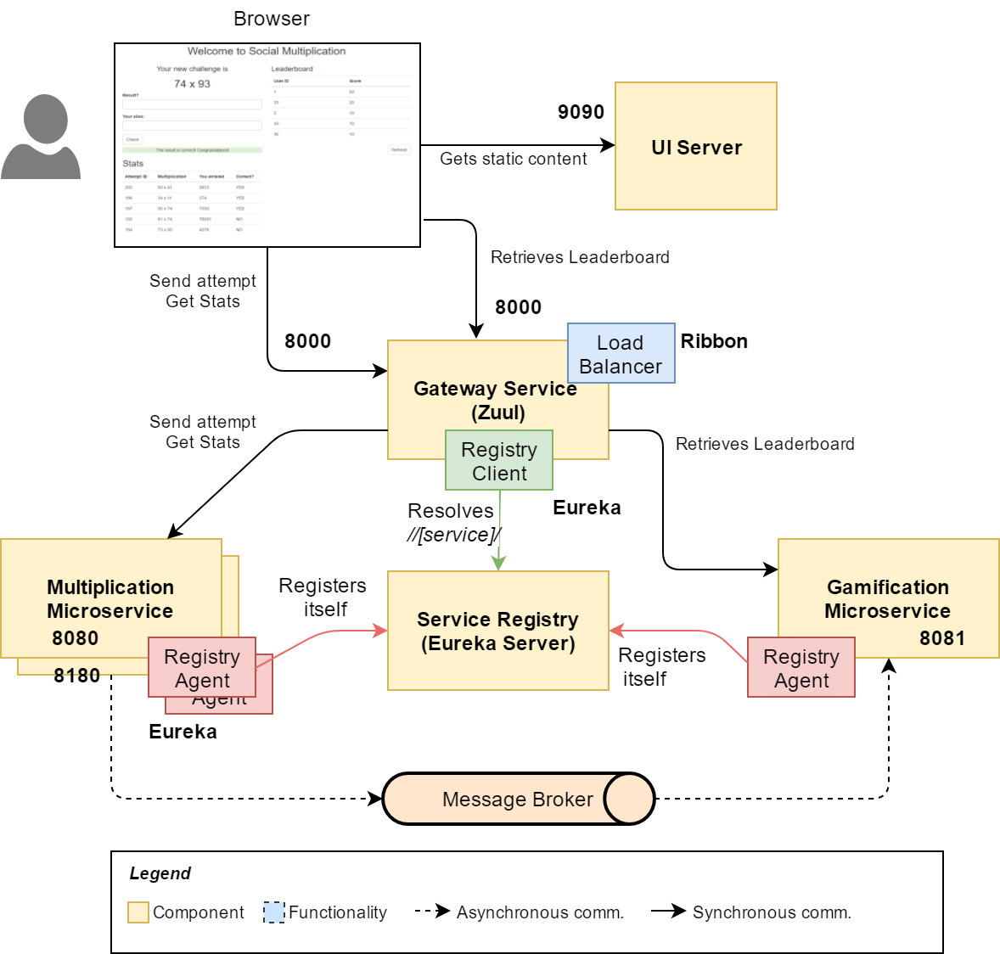

# Microservices - The Practical Way - v8

This project contains the version 8 of the application that is developed under the scope of the book Microservices - The Practical Way. 
You can get a copy of the book on [Leanpub](https://leanpub.com/microservices-thepracticalway).

## Idea

These projects, included in [Microservices-Practical repositories](https://github.com/microservices-practical), illustrate how to start an application from scratch and then evolve it to become a full microservices environment.

This version introduces Load Balancing with Ribbon, configured to detect services that are down through a `PingUrl` and combined with an `AvailabilityFilteringRule`.

## Contents

The repository contains five folders, one for each component of the system:

* **social-multiplication** is one of the backend services. It has a REST API to get and provide results to simple multiplications. When an attempt is sent, it triggers an *event*.
* **gamification** is the second backend service. It provides a REST API to get game stats and reacts to the event sent by the multiplication service, updating the figures.
* **service-registry** is the Eureka Server, which is contacted by backend services and the gateway.
* **gateway** is the Routing Service, implemented with Zuul. It connects with Eureka for service discovery, and performs load balancing with Ribbon.
* **ui** contains the static files of the frontend application. It's configured to be started with Jetty.

## How to execute the application

Since in this version we don't have yet scripts to do it, we need to run the applications manually. These are the instructions:

* **UI**. Download and install [Jetty](http://www.eclipse.org/jetty/download.html). From the command line, execute `java -jar [JETTY_HOME]/jetty-[VERSION]/start.jar` (replace the values between brackets accordingly). You also need Java.
* **RabbitMQ**. Download and install [RabbitMQ](https://www.rabbitmq.com/download.html). We use it as Event bus. When you have installed it, you need to run the RabbitMQ server (as a service or as a process, whatever you prefer).
* **Multiplication, Gamification, Service Registry and Gateway**. You need to start all these services using the command line. Navigate to each folder and execute for every one of them: `./mvnw spring-boot:run`. If you want to try load balancing you can execute more than one instance of the Multiplication or Gamification service. To do that, override the port number to avoid clashing: `./mvnw spring-boot:run -Drun.arguments="--server.port=A_FREE_PORT]"`

